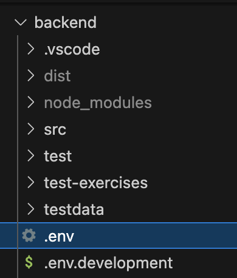

# Exercise 1: Initial setup and test LLM provider

[&#x25c0; Go back to start page](../README.md)

Welcome to the workshop! In this exercise, you'll prepare your environment, retrieve the latest code, and run a simple test to verify your LLM provider API key.

# Step-by-step instructions

## 1. Fetch latest updates from workshop repository

Open your terminal and navigate to the repository folder `gaia2025-llm-workshop`. 

```
cd gaia2025-llm-workshop
```

Run the following command to ensure you have the latest version of the code:

```
git pull origin main
```

## 2. Open the Project in your IDE

Before proceeding, open the project in your favorite IDE. For example, if you are using Visual Studio Code, you can run below command:

```
code .
```

Above command will launch VS Code with the current project folder.

## 3. Install the backend

In your terminal, navigate to the `backend` folder and install the necessary dependencies by running the following commands:
```
cd backend
npm install
```

> **_NOTE:_** *Installing dependencies may take up to a few minutes. While it's running, please proceed to the next step (Step 4).*

## 4. Configure your LLM API key

Inside the `backend` directory, create a new file named `.env`:



Add your API key into that file as follows:

```
# .env in the backend directory
GEMINI_API_KEY=your_api_key
```


> **_NOTE:_** *Replace `your_api_key` with the key provided on your printed workshop note. You can either type it manually or scan the QR code on the note to copy it easily from your phone.*

## 5. Verify API key and LLM provider connectivity

Once the `npm install` command has finished in folder `backend` and you have configured the API key, verify the API key and LLM provider connectivity by executing below command:
```
npm run test-exercise-1
```

Then, verify that the terminal displays log output similar to the sample below:

```
❯ npm run test-exercise-1

> backend@1.0.0 test-exercise-1
> NODE_ENV=development ts-node test-exercises/exercise_1.ts

API key in "GEMINI_API_KEY" validated for provider "gemini" [OK]
Connection successful for provider gemini. Status: 200 [OK]
All checks passed [OK]
```

> **_NOTE:_** *If you experience issues with network connectivity to Google's Gemini LLM provider, please inform one of the workshop facilitators. They can provide you with an API key for an alternative backup LLM provider, such as Mistral.*

## 6. Start backend and verify database connectivity

In the existing terminal, start the backend by executing below command:
```
npm run dev
```

Then, verify that the terminal displays log output similar to the sample below:

```
[12:50:46 PM] Starting compilation in watch mode...

[12:50:49 PM] Found 0 errors. Watching for file changes.

Allowed origins [ 'http://localhost:5173' ]
NODE_ENV development
Connected to foodDB at mongodb://127.0.0.1:54903/
API key in "GEMINI_API_KEY" validated for provider "gemini" [OK]
Server started at http://localhost:3000
```

> **_NOTE:_** *If you experience issues with network connectivity to the foodBD, please reach out to one of the workshop facilitators for assistance with troubleshooting.*

## 7. Start and test frontend

Open a **second terminal window**, navigate to the `frontend` folder and start the frontend by executing below commands:
```
cd frontend
npm install
npm run dev
```

Then, verify that the terminal displays log output similar to the sample below:

```
  VITE v5.4.14  ready in 1003 ms

  ➜  Local:   http://localhost:5173/
  ➜  Network: use --host to expose
  ➜  press h + enter to show help
```

Once the frontend is running, open your web browser and navigate to:\
👉 http://localhost:5173/

To test that the frontend is working:
1. Click on the `[+] Recipe` button to navigate to the Add Recipe view:\
👉 http://localhost:5173/add
2. Press the blue `Use Favorite` button to autofill the recipe URL field with a predefined recipe.
3. Then press `Fetch from web` to attempt to parse a recipe from the Internet.

> **_NOTE:_**  ⚠️ You will see an error message indicating that the operation failed — this is expected because the functionality is not yet implemented in the backend. You will address this in the next exercise.

## Next steps

Once you've confirmed that:
- [ ] Your API key is correctly configured
- [ ] Your connection to the LLM provider works
- [ ] The backend and database are running
- [ ] The frontend is running and accessible

You are ready to proceed to Exercise 2, where you will start building features such as extracting recipe text from a web page.

[&#x25B6; Click here to proceed to Exercise 2](./exercise-2.md)